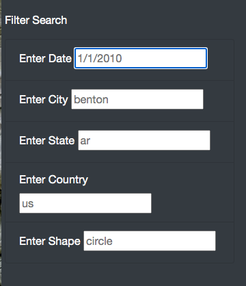

# UFO Sightings Dynamic Webpage 

## Overview

The purpose of this project was to create a dynamic webpage that displays detailed and expansive UFO sighting information that can be easily filtered based on user input. To accomplish, JavaScript functionality was inserted into an html webpage that displays a table of UFO sighting information that includes the date, country, city, state, and type of sighting. Finally CSS and Bootstrap were used to further enhance the visual aesthetics of the site. 

## Results 

To use the webpage, users enter their filter parameters in the form shown below and press enter. They can filter by any combination of parameter or simply scroll through the unfiltered data. 

To reset the filter form, the user can either delete the input in the form or click the "UFO Sightings" button in the top left corner, as shown below. 

## Summary

### Design Flaws

One drawback of this webpage design is that the method of resetting the filters is not clear. A more straightfoward and intuitive method of refreshing the filters would be placing the "UFO Sightings" button immediately under the form and renaming it "Refresh Filters." 

### Reccomendations for Further Development

Interesting further developments could include various analyses such as showing the top 5 cities with the most UFO sightings within the dataset. Similarly, a histogram showing the days or months with the most UFO sightings would be interesting. Further development could also improving on the original dataset by including more up to date data. If the original data was brought up to date and continually updated, it would then be useful to have a function that sorts sightings by most recent. 